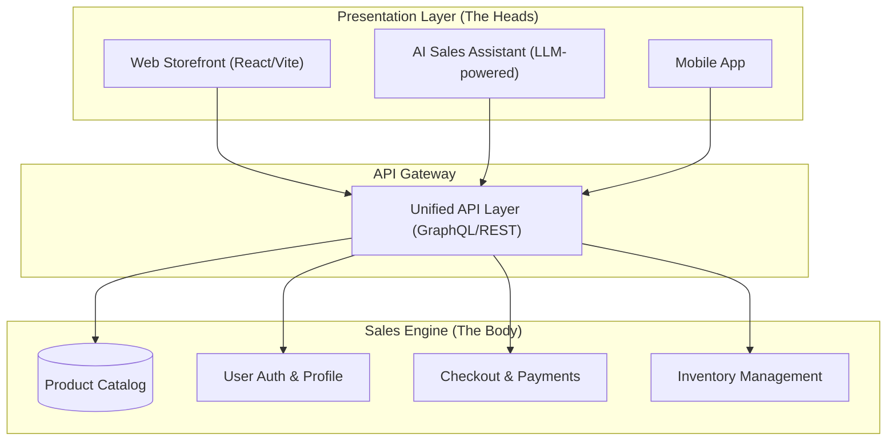

# Headless E-commerce & AI Sales Strategy

In the context of **MitchWeb**, our "Headless E-commerce + AI-powered Sales Platform" project, the term "headless" is a foundational architectural choice that directly enables our ability to leverage AI for sales.

## What "Headless" Means for MitchWeb

Traditional e-commerce platforms are "monolithic," meaning the frontend (the "head" or user interface) and the backend (the database, business logic, and checkout engine) are tightly coupled.

**Headless architecture** decouples these two layers. The backend—our **Sales Engine**—becomes a collection of APIs and services that manage products, inventory, customers, and transactions. It doesn't care *how* the data is displayed; it only cares about providing the data when requested.

For MitchWeb, this means:
- **The Sales Engine**: A robust backend containing all product data, pricing rules, and sales logic.
- **Multiple Heads**: We can attach any number of frontends to this single engine simultaneously.
  - **Web Head**: A fast, modern React/Vite-based storefront.
  - **AI Head**: Our AI Sales Agents that interact with customers via chat or voice.
  - **Mobile Head**: A native application or wearable interface.

## Architecture Overview

The following diagram illustrates how the Headless Sales Engine serves both human and AI interfaces.

## Enabling the AI Sales Strategy

The "headless" nature of our platform isn't just a technical preference; it is the **strategic engine** behind our AI sales capability.

### 1. AI as a First-Class Citizen
In a traditional system, an AI chatbot is often a "plugin" that scrapes the website frontend to get data. In our headless system, the **AI Assistant is a first-class consumer** of the same raw data as the web storefront. It perceives the system exactly as the website does, ensuring accuracy and speed.

### 2. Real-Time Intelligence & Consistency
When a customer asks the AI, "Is this item in stock?" or "What's the best price for me?", the AI queries the Sales Engine API directly.
- **Accuracy**: No lag between the website showing "In Stock" and the AI saying "Out of Stock."
- **Personalization**: The AI can access the user's profile and order history via API to offer personalized discounts or recommendations.

### 3. Contextual Transactional Capability
Because the Sales Engine handles the logic, the AI doesn't just "talk" about products—it can **execute transactions**. The AI head can trigger the `Checkout` and `Order` APIs, allowing a customer to complete a purchase entirely through a conversation without ever visiting the web storefront.

### 4. Omnichannel Sales Synergy
Data generated by the AI head (like common customer questions or abandoned chat carts) can be analyzed and used to optimize the Web head, and vice versa. The Sales Engine acts as the "single source of truth" for all sales intelligence.

## Technical & Business Benefits

| Benefit | Impact on MitchWeb |
| :--- | :--- |
| **Agility** | We can update the AI models or the Web design without touching the core Sales Engine. |
| **Scalability** | The Sales Engine can handle thousands of concurrent AI and human requests independently. |
| **Omnichannel** | Sell anywhere—web, social media, VR, or AI assistants—using one backend. |
| **Performance** | API-first design ensures fast response times, critical for low-latency AI conversations. |
