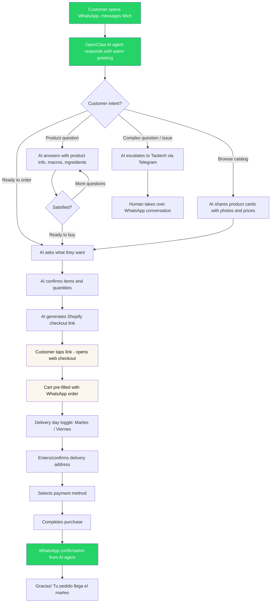

# UX Design Specification MitchWeb

**Author:** Taotech
**Date:** 2026-03-07

---

<!-- UX design content will be appended sequentially through collaborative workflow steps -->

## Executive Summary

### Project Vision

MitchWeb is the digital storefront for Jocoque & Yogurt Mich — translating an intensely personal, phone-based buying relationship with a 70-year-old Lebanese artisan into a premium e-commerce experience that preserves the warmth and trust of ordering directly from Michel. The UX must bridge two worlds: the simplicity of a phone call and the capability of a modern D2C platform. The brand speaks two languages simultaneously — heritage storytelling for food lovers and functional nutrition data for fitness/keto buyers — and the UX must serve both without overwhelming either.

### Target Users

**Primary (D2C Web & WhatsApp):**
- **Gourmet Discovery Shoppers** — Urban professionals in Puebla/CDMX who shop at specialty stores. Quality-seeking, ingredient-conscious, but not necessarily tech-savvy. They discovered Mich through physical retail and word-of-mouth. Transitioning them to digital ordering is the core UX challenge.
- **Mediterranean Heritage Loyalists** — High-volume repeat buyers (4-5 containers/week) with cultural connection to the product. They evangelize the brand. These are subscription candidates once trust in the digital channel is established.
- **Fitness/Keto Consumers** — Macro-aware, digitally comfortable, actively searching for clean high-protein/keto dairy. More likely to discover Mich online and convert via web. Need nutritional data front-and-center.

**Secondary (B2B):**
- **HORECA Buyers** — Restaurants/chefs who need bulk pricing, reliable supply, and a simple reorder flow.
- **Gourmet Retail Partners** — Specialty shops; their relationship is managed offline, not through the storefront.

### Key Design Challenges

1. **Low tech-savviness barrier** — Current customers order by phone. The storefront must be radically simple: minimal steps, large tap targets, clear visual hierarchy, no cognitive overhead. If it feels harder than calling Michel, they'll call Michel.
2. **Dual messaging without clutter** — Heritage storytelling and nutritional macros must coexist on product pages without creating information overload. Two audiences, one page, clean experience.
3. **Delivery day constraint** — Martes/viernes only delivery in a limited zone (Puebla/Cholula) is unusual for e-commerce. This must feel like a feature ("fresh artisanal delivery schedule") not a limitation.
4. **Trust transfer** — Customers trust Michel personally. The digital experience must transfer that trust to the brand — through authentic photography, Michel's story, and a WhatsApp lifeline that feels like texting a person, not a bot.
5. **Cold product e-commerce** — Buying perishable dairy online is unfamiliar for many Mexican consumers. The UX must address freshness concerns, delivery reliability, and glass container handling without creating anxiety.

### Design Opportunities

1. **WhatsApp as the comfort bridge** — A persistent, prominent WhatsApp CTA on every page serves as a safety net. "Not sure? Just message us." This lowers the barrier for non-tech-savvy users and mirrors the phone-call relationship they already have.
2. **Keto/fitness as digital-first acquisition** — Unlike existing customers, fitness/keto consumers are digitally native and actively searching. Product pages optimized with macro badges and keto-friendly labels can capture this audience organically via SEO and social.
3. **Subscription as the ultimate simplification** — For heavy users (4-5/week), a subscription eliminates all friction: "Set it once, yogurt arrives every Tuesday." This turns the UX challenge of repeat ordering into a one-time setup.
4. **Glass packaging as a brand moment** — The premium glass container is a differentiator. The UX can celebrate this visually (beautiful product photography, sustainability messaging) and functionally (jar return program in Phase 2).
5. **Heritage storytelling as emotional UX** — Michel's authentic Lebanese story is not just marketing — it's a UX asset. An "Our Story" experience with real photos of Michel in his kitchen builds the trust that makes a first-time online food purchase feel safe.

## Core User Experience

### Defining Experience

The core experience of MitchWeb is **effortless reordering of a product people already love**. The first visit converts through beautiful product photography and a WhatsApp safety net; every visit after that should feel like muscle memory. Browsing exists for discovery and delight — new SKUs, seasonal products, heritage content — but is never a gate between the customer and their usual order.

The storefront operates as one half of a **dual-channel commerce experience** alongside WhatsApp. Neither is primary; they are parallel paths to the same cart and checkout. A customer might browse the web, ask a question on WhatsApp, and complete checkout on either — the experience must feel seamless across both.

### Platform Strategy

| Dimension | Decision | Rationale |
|---|---|---|
| **Primary platform** | Mobile web (Shopify Hydrogen) | Target users are on smartphones; WhatsApp traffic lands on mobile |
| **Input mode** | Touch-first | Large tap targets, thumb-friendly navigation, minimal typing |
| **Responsive** | Mobile-first, single desktop breakpoint (md: 768px) | Desktop is secondary but must work for office-browsing gourmet shoppers |
| **Offline** | Not required | Perishable goods with delivery scheduling — always needs live inventory |
| **Device capabilities** | WhatsApp deep linking, native share | Leverage WhatsApp as installed app; enable easy product sharing to contacts |
| **Language** | Spanish only (es-MX) | All UI, content, and messaging in Mexican Spanish |

### Effortless Interactions

1. **Reordering** — A returning customer should be able to reorder their usual products in the fewest possible taps. Account-based order history with a "reorder" action. Phase 2 subscriptions eliminate this entirely.
2. **Adding to cart** — Quick-add from catalog views without navigating to a product page. Size selection inline where possible.
3. **Delivery day selection** — Martes or viernes presented as a simple toggle, not a calendar picker. Pre-selected based on the next available day.
4. **WhatsApp access** — Persistent floating CTA on every page. One tap opens a WhatsApp conversation with context (e.g., the product they were viewing). No forms, no "contact us" pages.
5. **Checkout** — Minimal fields. Shopify handles payments. Delivery address with zone validation that tells you immediately if you're in the delivery area — no filling out a full form only to be rejected at the end.

### Critical Success Moments

1. **First visit → "I want this"** — Product photography does the heavy lifting. The product must look premium, fresh, and real (not stock photography). Glass containers, natural textures, Michel's kitchen. This is the moment that converts a curious visitor into a first-time buyer.
2. **First checkout → "That was easy"** — If checkout feels simple and fast (3-4 taps after cart), the customer trusts the platform for next time. If it's confusing, they go back to calling Michel.
3. **First delivery → "This is legit"** — Outside the storefront's control, but the UX sets expectations: clear delivery day confirmation, WhatsApp notification when the order is on its way, glass packaging that matches the premium web experience.
4. **Second purchase → "I'll just order online"** — The reorder flow must be noticeably faster than a phone call. This is when the digital channel wins permanently.
5. **WhatsApp conversation → "They actually know the product"** — The AI agent must answer product questions with the same warmth and knowledge as Michel. This validates the parallel channel.

### Experience Principles

1. **Simpler than a phone call** — Every flow must require fewer steps and less effort than calling Michel and dictating an order. If digital isn't easier, it won't be adopted.
2. **Show, don't explain** — Product photography and visual design carry the trust and desire. Minimize text walls; let the product sell itself visually.
3. **WhatsApp is always one tap away** — The customer should never feel stuck or confused. WhatsApp is not a fallback — it's a first-class parallel experience that's always visible and contextual.
4. **Browsing is a gift, not a gate** — Discovery of new products, heritage content, and nutritional info is available for those who want it, but never blocks the path to purchase for those who already know what they want.
5. **Delivery is a feature, not a constraint** — "Fresh artisanal delivery, martes y viernes" positions the limited schedule as a quality signal, not a limitation.

## Desired Emotional Response

### Primary Emotional Goals

| Emotion | Description | When It Matters Most |
|---|---|---|
| **Appetite & Authenticity** | "This is beautiful, this is real, I can almost taste it." The site should make you hungry and make you trust the source. | First visit, product pages, homepage hero |
| **Exclusivity** | "I discovered something special that most people don't know about." The feeling that drives sharing — not showing off, but being the person who finds the hidden gems. | Brand storytelling, packaging presentation, sharing moments |
| **Confidence** | "This is handled. These people know what they're doing." Quiet professionalism that earns trust without needing to beg for it. | Checkout, delivery communication, error states, customer service |
| **Ease** | "That was so simple." The relief of something complex (buying perishable food online) feeling effortless. | Cart, checkout, reordering, delivery day selection |

### Emotional Journey Mapping

| Stage | Desired Emotion | Design Lever |
|---|---|---|
| **Discovery** (first landing) | Appetite + curiosity — "What is this?" | Hero photography of product in glass, warm tones, minimal text |
| **Exploration** (browsing products) | Desire + trust — "I want this, and it's legit" | Close-up product photography, clean ingredient lists, macro badges |
| **Heritage story** (about page) | Warmth + respect — "There's a real person behind this" | Authentic photos of Michel, his kitchen, his hands working. Not polished — real. |
| **Adding to cart** | Satisfaction — "This feels premium" | Smooth animation, clear feedback, no friction |
| **Checkout** | Confidence — "Easy, I've got this" | Minimal steps, familiar payment options, immediate zone confirmation |
| **Post-purchase** | Anticipation — "I can't wait for Tuesday" | Clear confirmation with delivery day, WhatsApp follow-up |
| **Error / out of stock** | Reassurance — "They'll make it right" | Confident, professional tone. Not apologetic — solution-oriented. Offer alternatives or notify-when-available. |
| **Return visit** | Comfort — "I know exactly what to do" | Familiar layout, fast reorder, remembered preferences |

### Micro-Emotions

**Critical to cultivate:**
- **Trust over skepticism** — Every element must feel genuine. No stock photos, no marketing-speak, no fake urgency ("Only 2 left!"). The product is real; the site must feel real.
- **Confidence over confusion** — At no point should a user wonder "what do I do now?" Clear visual hierarchy, obvious next actions, WhatsApp always visible as backup.
- **Delight over mere satisfaction** — Small moments of beauty: a well-composed product photo, a smooth cart interaction, a warm WhatsApp greeting. Not flashy — understated premium.
- **Belonging over isolation** — "I'm part of something" — the community of people who know about Mich. Phase 2 social proof reinforces this.

**Critical to avoid:**
- **Generic e-commerce feeling** — This must never feel like "just another online store." No stock imagery, no cookie-cutter layouts, no corporate voice.
- **Clinical coldness** — Nutritional data is important but must be presented warmly, not like a medical label.
- **Overwhelm** — Dual messaging (heritage + nutrition) is a risk. Information must be layered, not dumped. Let users discover depth at their own pace.
- **Faceless brand feeling** — Michel exists. His hands, his kitchen, his story must be visible. The brand has a face — use it.

### Design Implications

| Emotional Goal | UX Design Approach |
|---|---|
| **Appetite & Authenticity** | Photography-led design. Hero images of product, not illustrations or graphics. Warm color palette (creams, earth tones, olive). Textures that evoke natural materials — linen, wood, glass. |
| **Exclusivity** | Restrained design — premium brands don't shout. Generous whitespace, understated typography, no cluttered promotions. The absence of noise signals quality. |
| **Confidence** | Professional error handling with solutions, not apologies. Clear delivery information upfront. Shopify checkout trust signals. Consistent, predictable layout. |
| **Ease** | Minimal form fields, large touch targets, smart defaults (next delivery day pre-selected), quick-add to cart, one-tap WhatsApp. |
| **Avoiding generic** | Custom typography pairing, brand-specific color palette, authentic photography only, Spanish-first copywriting voice that feels like a person talking — warm, direct, never corporate. |

### Emotional Design Principles

1. **Photography is the primary emotional medium** — Words convince, but photos create desire. Every product image should make you hungry. Every brand image should make you feel the craft.
2. **Premium is quiet** — Exclusivity is communicated through restraint: whitespace, typography, pacing. No banners, no pop-ups, no urgency tactics. The product speaks for itself.
3. **Confidence, not apology** — When things go right, the experience feels effortless. When things go wrong, the response is "here's what we're doing" — never begging, never panicking.
4. **Warmth through authenticity** — The emotional warmth comes from real content (Michel's photos, genuine stories, actual ingredients) not from design tricks (rounded corners, playful illustrations, emoji).
5. **Layered depth** — Surface level is clean and simple (photo + price + add to cart). One layer down reveals nutrition, heritage, ingredient sourcing. Users choose their depth — nobody is overwhelmed.

## UX Pattern Analysis & Inspiration

### Inspiring Products Analysis

**1. Rappi / Cornershop (Familiar Commerce Baseline)**

What your customers already know. These apps set the expectations for buying food on a phone in Mexico.

| UX Strength | Relevance to MitchWeb |
|---|---|
| Product image as primary decision driver | Validates our photography-first approach |
| Minimal-tap add-to-cart from browse view | Direct pattern to adopt for quick-add |
| Clear delivery time/day communication | Model for martes/viernes scheduling UX |
| Address-based zone validation upfront | Pattern for delivery zone confirmation |
| OXXO / card / SPEI payment familiarity | Users expect these exact payment options |

**2. Amazon / Mercado Libre (Reorder & Trust Baseline)**

The "buying stuff online" mental model your customers carry.

| UX Strength | Relevance to MitchWeb |
|---|---|
| "Buy again" / reorder from order history | Core pattern for our reorder flow |
| Product ratings and reviews as trust signals | Phase 2 social proof — users expect this |
| Predictable layout — users never get lost | Consistency principle for our navigation |
| One-click purchase for repeat buyers | Aspiration for our reorder simplification |

**3. Aesop (Premium Craft Tone)**

The emotional and visual benchmark for "quiet luxury" e-commerce.

| UX Strength | Relevance to MitchWeb |
|---|---|
| Photography-led product pages with generous whitespace | Direct model for our visual approach |
| Restrained typography — no shouting, no banners | Aligns with "premium is quiet" principle |
| Product descriptions that tell a story, not just specs | Model for heritage + ingredient storytelling |
| Muted, warm color palette with natural tones | Reference for our cream/earth/olive palette |
| Minimal navigation — you can't get lost | Supports low tech-savviness requirement |

**4. Blue Bottle Coffee (Artisanal D2C + Subscription)**

The closest functional model — craft product, D2C, subscriptions, limited delivery.

| UX Strength | Relevance to MitchWeb |
|---|---|
| Subscription presented as the default, not an add-on | Phase 2 model for subscription UX |
| Simple product line (few SKUs, presented clearly) | Mich has a small catalog — this is a strength |
| "How it's made" content integrated into shopping flow | Model for Michel's heritage story placement |
| Clean mobile experience with large product imagery | Validates mobile-first, photography-led approach |

**5. Compartes Chocolates (Product as Hero)**

The product photography standard for artisanal food e-commerce.

| UX Strength | Relevance to MitchWeb |
|---|---|
| Product IS the visual design — packaging fills the screen | Glass containers should be our visual hero |
| Color from product, not from UI chrome | Let the yogurt, labneh, and glass do the talking |
| Minimal UI that stays out of the product's way | Supports our layered depth principle |

### Transferable UX Patterns

**Navigation Patterns:**
- **Bottom tab bar (Rappi model)** — Mobile-first navigation with 4-5 tabs: Home, Products, Cart, Account, WhatsApp. Thumb-friendly, familiar to Rappi/app users. Architecture already specifies this (FR42).
- **Flat product catalog (Blue Bottle model)** — Small SKU count (5-8 products) doesn't need categories or filters. A single scrollable product grid with quick-add is sufficient and simpler.

**Interaction Patterns:**
- **Quick-add to cart from grid (Rappi model)** — Plus button or "Agregar" directly on product cards. No forced navigation to product detail page.
- **Reorder from history (Amazon model)** — Account page shows past orders with a single "Volver a pedir" button that adds all items to cart.
- **Delivery day toggle (custom)** — Two-option toggle (Martes / Viernes) instead of date picker. Pre-selects next available day. Simpler than anything Rappi or Amazon does because we only have two options.

**Visual Patterns:**
- **Photography-led hero (Aesop / Compartes model)** — Full-width product photography as the primary homepage element. Minimal overlay text. Let the image sell.
- **Whitespace as luxury signal (Aesop model)** — Generous spacing between elements. No sidebar, no banners, no promotional clutter. The emptiness communicates premium.
- **Warm natural palette (Aesop model)** — Creams, warm whites, earth tones, olive accents. Glass and natural textures. No bright blues, no neon CTAs.

### Anti-Patterns to Avoid

| Anti-Pattern | Why It's Wrong for MitchWeb | Where We'd See It |
|---|---|---|
| **Pop-up newsletter capture on first visit** | Breaks the "appetite & authenticity" first impression. Interrupts the photography moment. | Common in generic Shopify themes |
| **Urgency tactics** ("Solo quedan 3!") | Contradicts exclusivity and confidence. Feels mass-market and desperate. | Amazon/MercadoLibre pattern — wrong for artisanal |
| **Category-heavy navigation** | With 5-8 SKUs, categories create empty pages and unnecessary clicks. | Default Shopify theme pattern |
| **Slider/carousel on homepage** | Users don't interact with them. Wastes the hero moment on rotating noise. | Common in e-commerce templates |
| **Stock photography or lifestyle imagery** | Instantly kills authenticity. Users will feel the disconnect. | Tempting shortcut before brand photography exists |
| **Dense product specification tables** | Clinical feeling. Nutritional data must feel warm, not medical. | Health food sites that over-index on data |
| **Chatbot popup ("How can I help?")** | Feels generic and annoying. WhatsApp CTA is the superior pattern — it's contextual and uses a tool users already trust. | Common SaaS pattern bleeding into e-commerce |
| **Complex account creation before purchase** | Friction at the worst moment. Shopify passwordless accounts solve this. | Legacy e-commerce pattern |

### Design Inspiration Strategy

**Adopt directly:**
- Rappi-style quick-add to cart from product grid
- Rappi-style bottom tab bar for mobile navigation
- Amazon-style reorder from order history
- Aesop-style generous whitespace and restrained typography
- Blue Bottle-style small catalog presentation (few products, shown beautifully)

**Adapt for MitchWeb:**
- Aesop's visual tone adapted to Mediterranean/Lebanese warmth (Aesop is cool and minimal; Mich should be warm and natural)
- Blue Bottle's subscription UX adapted for delivery day constraints (martes/viernes toggle instead of frequency picker)
- Compartes' product-as-hero photography adapted for glass containers with food (texture, appetite appeal, not just packaging design)

**Avoid entirely:**
- Amazon/MercadoLibre's density, promotional noise, and urgency tactics
- Generic Shopify theme patterns (pop-ups, sliders, deep category trees)
- Chatbot pop-ups (WhatsApp CTA replaces this entirely)
- Any stock photography or staged lifestyle imagery

## Design System Foundation

### Design System Choice

**Tailwind CSS + shadcn/ui** — A utility-first CSS framework paired with a copy-paste component library built on Radix UI accessible primitives.

This is not a traditional design system dependency. shadcn/ui components are copied into the project at `/app/components/ui/` and become owned code — fully customizable, no version lock-in, no library updates to track.

### Rationale for Selection

| Factor | Assessment |
|---|---|
| **Timeline** | Fastest path to a custom-branded store. Pre-built interactive patterns (buttons, toggles, cards, dialogs) eliminate low-value custom work. |
| **Brand uniqueness** | Components are fully customizable via Tailwind. The warm Mediterranean premium aesthetic is achieved through design tokens (colors, typography, spacing), not fighting a library's defaults. |
| **Single developer** | Reduces decision fatigue. Professional defaults for interactive patterns let you focus custom effort on the 5-6 brand-specific components. |
| **Hydrogen compatibility** | Tailwind-native, works alongside Hydrogen's built-in components (`<Image>`, `<Money>`, `<Link>`) without conflict. |
| **Accessibility** | Radix UI primitives provide WCAG-compliant keyboard navigation, focus management, and screen reader support. Meets the WCAG 2.1 Level AA target. |
| **Component count** | MitchWeb needs ~12-15 components total. This is too small to justify a full design system, too large to build every interactive pattern from scratch. |

### Implementation Approach

**Component sourcing strategy:**

| Component Type | Source | Examples |
|---|---|---|
| **Commerce components** | Hydrogen built-in | `<Image>`, `<Money>`, `<Link>`, `<CartForm>` |
| **Interactive UI primitives** | shadcn/ui (copied + customized) | Button, Toggle, Card, Dialog, Sheet (mobile menu), Badge |
| **Brand-specific components** | Custom-built with Tailwind | `NutritionLabel`, `DeliveryDaySelector`, `DeliveryZoneNotice`, `WhatsAppCTA`, `HeroBanner`, `ProductCard`, `FreeShippingBar` |
| **Layout components** | Custom-built with Tailwind | `Layout`, `Header`, `Footer`, `BottomTabBar` |

**File structure addition:**

```
app/
  components/
    ui/              # shadcn/ui copied components (Button, Toggle, Card, etc.)
    Layout.tsx        # Custom brand components
    ProductCard.tsx
    ...
```

### Customization Strategy

**Design tokens** (defined in `tailwind.config.ts`):

- **Colors:** Custom warm palette — creams, earth tones, olive, glass-inspired accents. No default Tailwind blue/gray.
- **Typography:** Custom font pairing — a refined serif or display font for headings (heritage feel), clean sans-serif for body (readability). Defined in next steps.
- **Spacing:** Generous — supports the "premium is quiet" whitespace principle.
- **Border radius:** Subtle — not rounded-full (playful) or sharp (corporate). Slightly rounded for warmth.
- **Shadows:** Minimal — premium brands use whitespace and contrast, not drop shadows.

All shadcn/ui components will be restyled through these tokens to match the Mich brand. The components provide behavior (toggle mechanics, focus management, keyboard nav); the design tokens provide the visual identity.

## Defining Experience

### The Core Interaction

**"You have to see this site — the products look amazing."**

MitchWeb's defining experience is not the transaction — it's the **moment of visual desire**. The site is a showcase that makes artisanal dairy irresistible through photography, presentation, and restraint. The commerce layer exists to convert that desire into action with zero friction, but the experience users talk about is how the products look and feel on screen.

This inverts the typical e-commerce priority. Most online stores optimize for conversion mechanics (cart, checkout, upsell). MitchWeb optimizes for **wanting** — the conversion follows naturally because the product sells itself visually.

### User Mental Model

**Current mental model:** "I call Michel, I tell him what I want, he delivers it." This is personal, trust-based, and zero-visual. The product quality is proven through taste, not presentation.

**New mental model we're creating:** "I open the Mich site, the products look incredible, I want them, I order." We're adding a visual layer to a relationship that was previously taste-and-trust only. The site becomes a window into Michel's kitchen — the glass containers, the textures, the craft — that creates desire even before the first taste.

**Key mental model shifts:**
- From "I know what I want, just let me order" to "I know what I want AND it looks even better than I imagined"
- From "I trust Michel because I know him" to "I trust Mich because I can see the quality"
- From "This is my secret local find" to "I want to share this beautiful thing I found"

**The sharing trigger:** Users share MitchWeb not because the ordering was easy, but because the **presentation is share-worthy**. A product page that looks like a food magazine spread makes people send the link to friends. The exclusivity emotion ("I found something special") is activated by visuals, not by words.

### Success Criteria

| Criteria | Indicator | Measurement |
|---|---|---|
| **Visual desire on first visit** | User spends time looking at products before adding to cart | Time on product pages > 20s before first add-to-cart |
| **Share-worthy presentation** | Users share product links or screenshots with friends | Referral traffic, WhatsApp share button usage |
| **Photography carries trust** | First-time buyers convert without reading detailed descriptions | Conversion rate from product page with minimal scroll |
| **Repeat visitors still enjoy browsing** | Returning customers browse even when they know what they want | Pages per session for returning visitors > 1.5 |
| **The site IS the brand** | Users reference the website when recommending Mich | NPS survey: "How did you hear about us?" includes "saw the website" |

### Novel UX Patterns

**Pattern classification: Established patterns, novel combination.**

MitchWeb doesn't need to invent new UX patterns. It needs to combine two well-understood approaches in a way that's rare for food e-commerce:

1. **Editorial/magazine product presentation** (established in fashion/luxury — Aesop, Mr Porter, Compartes) — photography-led, whitespace-rich, storytelling-integrated
2. **Frictionless food ordering** (established in delivery apps — Rappi, Cornershop) — quick-add, minimal checkout, delivery scheduling

The novel combination: **luxury editorial presentation + food delivery simplicity**. Most artisanal food sites choose one or the other. Beautiful sites with slow, complex checkout. Or fast, ugly ordering interfaces. MitchWeb does both — looks like a food magazine, orders like Rappi.

**No user education needed.** Every individual pattern (product grid, add to cart, checkout, WhatsApp) is familiar. The innovation is in the combination and the visual quality, not in new interaction mechanics.

### Experience Mechanics

**The Visual Desire Flow (step by step):**

**1. Initiation — The Hero Moment**
- User lands on homepage (likely from WhatsApp link, social media, or word-of-mouth)
- Full-screen hero photograph: glass container of yogurt or labneh, natural light, textured surface, Michel's kitchen in the background
- Minimal text overlay — brand name, one line ("Yogurt griego artesanal, hecho a mano en Puebla")
- Scroll or tap reveals the product grid below
- The first 2 seconds are pure visual impact — no navigation, no pop-ups, no distractions

**2. Interaction — Browsing as Visual Experience**
- Product grid: large product photos in glass containers, product name, price, quick-add button
- Each product card is a mini food photograph — not a catalog thumbnail
- Tapping a product opens the full product page: hero photo, then layered information (price then macros badge then ingredients then heritage story)
- Quick-add from grid for users who already know what they want
- Product detail page for users who want to explore and discover

**3. Feedback — Desire Confirmed**
- Add-to-cart animation is smooth and satisfying (not just a number incrementing)
- Cart preview slides in, showing product photos (not just names and quantities)
- Delivery day is pre-selected (next available martes or viernes) — reinforces "it's almost here"
- Cart total with delivery information: "Entrega el martes 11 de marzo"

**4. Completion — Anticipation**
- Checkout is Shopify-managed (trusted, familiar, fast)
- Confirmation page reinforces the visual brand — product images, delivery day, WhatsApp contact
- WhatsApp confirmation message arrives immediately — personal, warm, with delivery details
- The user closes the browser feeling: "That was beautiful, easy, and my yogurt comes Tuesday"

## Visual Design Foundation

### Color System

**Brand Color Architecture:**

The Mich color system is built on a **Mediterranean** identity — warm, ornate, old-world. The brand palette is gold, cream, and dark earth tones. Product line accents (Lebanese green, Greek blue) appear only in product-specific contexts and never in the global UI.

**Mediterranean Brand Palette (Global):**

| Token | Color | Hex (approximate) | Usage |
|---|---|---|---|
| `gold` | Antique gold | `#C6A855` | Primary brand accent — logo, headings, borders, ornate details, CTA buttons |
| `gold-light` | Champagne | `#E8D5A3` | Highlights, hover states, subtle accents |
| `gold-dark` | Deep brass | `#8B7332` | Text on light backgrounds, secondary accents, button hover |
| `cream` | Warm ivory | `#FAF6EE` | Primary light background |
| `cream-dark` | Warm beige | `#F0E8D8` | Secondary background, card surfaces |
| `dark` | Rich charcoal-brown | `#1A1612` | Dark hero sections, primary text on light backgrounds |
| `dark-surface` | Dark warm | `#2A2420` | Dark section cards, overlays, footer |
| `white` | Soft white | `#FEFEFE` | Text on dark backgrounds, clean spacing |
| `burlap` | Natural tan | `#C4A882` | Texture accents, dividers, borders, subtle warmth |
| `terracotta` | Warm earth | `#B87333` | Earthy accent — earthenware reference, warm highlights |

**Product Line Accents (Product Context Only):**

These colors appear **only** on product cards, product detail pages, product badges, and product labels. They never appear in navigation, buttons, footer, header, cart, or checkout.

| Token | Color | Hex (approximate) | Context |
|---|---|---|---|
| `lebanese` | Deep forest green | `#1B4332` | Jocoque product labels, badges, product page accent |
| `lebanese-medium` | Mediterranean green | `#2D6A4F` | Jocoque hover states, secondary product elements |
| `lebanese-surface` | Green tint | `#E8F0EC` | Jocoque product page background tint |
| `greek` | Deep Mediterranean blue | `#1B3A5C` | Yogurt product labels, badges, product page accent |
| `greek-medium` | Aegean blue | `#2D5F8A` | Yogurt hover states, secondary product elements |
| `greek-surface` | Blue tint | `#E8EEF4` | Yogurt product page background tint |

**Semantic Colors:**

| Token | Color | Usage |
|---|---|---|
| `success` | `#2D6A4F` | Confirmation, added to cart, zone valid |
| `error` | `#C45B3E` (warm terracotta-red) | Errors, out of stock, zone invalid |
| `warning` | `gold` | Low stock notices, delivery reminders |
| `whatsapp` | `#25D366` | WhatsApp CTA button only — isolated from brand palette |

**Color Application Map:**

| Element | Colors Used | Never Use |
|---|---|---|
| **Header / Navigation** | `dark` or `cream` bg, `gold` logo, `gold-dark` text | Green or blue |
| **Homepage hero** | `dark` bg, `gold` / `white` text, product photography | Green or blue |
| **CTA buttons** | `gold` bg with `dark` text, or `dark` bg with `gold` text | Green or blue |
| **Product card (Jocoque)** | `cream` card, `lebanese` badge/label accent | Blue |
| **Product card (Yogurt)** | `cream` card, `greek` badge/label accent | Green |
| **Product page (Jocoque)** | `cream` bg with `lebanese-surface` tint sections, `lebanese` accents | Blue |
| **Product page (Yogurt)** | `cream` bg with `greek-surface` tint sections, `greek` accents | Green |
| **Mixed catalog grid** | `cream` bg, each card shows its own product line accent | — |
| **Cart / Checkout** | `cream` / `white` bg, `dark` text, `gold` accents | Green or blue |
| **Heritage / About** | Dark sections (`dark` bg, `gold` / `white` text) + light sections | Green or blue |
| **Footer** | `dark` bg, `cream` / `gold` text | Green or blue |
| **Bottom tab bar** | `dark` bg, `gold` active icon, `burlap` inactive icons | Green or blue |

**Dark/Light Section Rhythm:**

The website alternates between dark dramatic sections and light shopping sections:

- DARK: Homepage hero — dramatic, gold text, photography
- LIGHT: Product grid — cream background, clean shopping
- DARK: Brand story strip — "The Art of Dairy" moment
- LIGHT: Product detail — cream with product-line accent
- DARK: Heritage/About sections — oil painting mood
- LIGHT: Cart/Checkout — clean, confident, functional
- DARK: Footer — anchoring close

### Typography System

**Font Pairing:**

| Role | Font | Fallback | Rationale |
|---|---|---|---|
| **Display / Headings** | Playfair Display | Georgia, serif | Old-world serif matching the brand concept's editorial quality. Ornate character at large sizes echoes the medallion's craftsmanship. |
| **Body / UI** | Inter | system-ui, sans-serif | Clean, highly readable sans-serif for all functional text — prices, descriptions, navigation, nutritional data. |
| **Accent** | Playfair Display Italic | Georgia, serif | Product names, quotes, heritage emphasis. Adds warmth without requiring a third font. |

**Type Scale (Mobile-First):**

| Level | Size | Weight | Font | Line Height | Usage |
|---|---|---|---|---|---|
| **Hero** | 2.5rem (40px) | 700 | Playfair Display | 1.1 | Homepage hero headline |
| **H1** | 2rem (32px) | 700 | Playfair Display | 1.2 | Page titles |
| **H2** | 1.5rem (24px) | 700 | Playfair Display | 1.25 | Section headings |
| **H3** | 1.25rem (20px) | 600 | Playfair Display | 1.3 | Product names, subsections |
| **Body** | 1rem (16px) | 400 | Inter | 1.6 | Descriptions, content |
| **Body Small** | 0.875rem (14px) | 400 | Inter | 1.5 | Secondary info, ingredients |
| **Caption** | 0.75rem (12px) | 500 | Inter | 1.4 | Badges, labels, micro-copy |
| **Price** | 1.25rem (20px) | 600 | Inter | 1 | Product prices |
| **Price Large** | 1.5rem (24px) | 700 | Inter | 1 | Cart total, featured price |

Desktop scale: Headings increase ~25% at `md:` breakpoint. Body text stays the same.

**Typography Rules:**
- Headings always Playfair Display — carries the brand's old-world Mediterranean personality
- UI elements (buttons, nav, prices, macros) always Inter — clarity over personality
- Product names use Playfair Display — they're brand elements, not UI
- Nutritional data uses Inter with tabular numbers
- Gold-colored text (`gold` / `gold-dark`) used for headings on dark backgrounds
- `dark` text on light backgrounds for all body copy
- All text in Mexican Spanish

### Spacing & Layout Foundation

**Spacing System (base unit: 4px):**

| Token | Value | Usage |
|---|---|---|
| `xs` | 4px | Badge padding, icon gaps |
| `sm` | 8px | Inner card padding, list items |
| `md` | 16px | Component padding, grid gaps |
| `lg` | 24px | Card spacing, section internal padding |
| `xl` | 32px | Section padding (mobile) |
| `2xl` | 48px | Section padding (desktop) |
| `3xl` | 64px | Major section separation |

**Layout Principles:**

1. **Generous whitespace** — The ornate brand identity is rich; the layout gives it room to breathe. Premium is quiet.
2. **Full-bleed heroes, contained content** — Dark/hero sections go edge-to-edge. Shopping content contained in max-w-6xl (1152px) with horizontal padding.
3. **Mobile-first grid:** 2-column product grid on mobile (large photos), 3-4 columns on desktop.
4. **No sidebar** — Single column flow. The ornate brand provides visual richness without UI complexity.
5. **Dark/light rhythm** — Alternating dramatic and clean sections creates pacing and visual interest.
6. **Gold as the interaction color** — All CTAs, active states, and interactive highlights use gold. This unifies the experience in the Mediterranean brand regardless of which product line the user is viewing.

### Accessibility Considerations

- All body text meets 4.5:1 contrast ratio (WCAG 2.1 Level AA)
- `gold` used for decorative/heading elements on dark backgrounds (3:1 minimum for large text) — never for small body text
- Product line colors (green/blue) on white text verified at 4.5:1
- Minimum touch target: 44x44px
- Minimum body text: 16px
- Color never the only indicator — product lines distinguished by labels and iconography, not color alone
- Focus states: gold outline ring on all interactive elements
- No auto-playing animations

## Design Direction Decision

### Design Directions Explored

Six design directions were generated and presented as interactive HTML mockups (`ux-design-directions.html`):

1. **Dark Immersive** — Full dark homepage, oil painting mood, gold on charcoal
2. **Light & Clean** — Cream backgrounds, white cards, product badges, comfortable shopping
3. **Editorial Scroll** — Storytelling-first vertical scroll, dark/light alternating sections
4. **Split Personality** — Category entry (Lebanese/Greek split), featured products below
5. **Product Detail** — Layered product page with photo, badges, macros, size selector
6. **Cart & Delivery** — Martes/viernes toggle, product photos, clean checkout flow

### Chosen Direction

**Editorial Scroll + Light & Clean hybrid** — combining Direction 3's storytelling structure with Direction 2's clean shopping feel.

**Homepage:** Editorial scroll — the page tells the brand story through alternating dark (dramatic, heritage) and light (products, shopping) sections. The MICH medallion hero opens the experience. Products are woven into the narrative, not separated from it. When the user is ready to buy, the interface shifts to clean cream backgrounds with easy quick-add cards.

**Product Detail:** Direction 5 — layered information architecture. Large product photo hero (with product-line surface tint), badge row (Lebanese/Greek + Keto), product name and description, price with inline size selector, macros panel in product-line surface color, full-width gold add-to-cart CTA, delivery day note.

**Cart:** Direction 6 — delivery day toggle (Martes/Viernes as two large pill buttons with dates), cart items with product photos and quantity controls, clean summary with gold total line, full-width gold checkout CTA, delivery confirmation line at bottom.

### Design Rationale

| Decision | Rationale |
|---|---|
| **Editorial scroll for homepage** | First-time visitors need to fall in love with the brand before they buy. The storytelling structure builds desire and trust through the visual narrative — matching our defining experience ("You have to see this site"). |
| **Light & clean for shopping** | Non-tech-savvy users need comfortable, readable shopping sections. Cream backgrounds with white cards reduce cognitive load and feel familiar (closer to what Rappi/Amazon users expect). |
| **Dark/light alternation** | Creates visual pacing — dark sections for emotional impact (hero, brand story, footer), light sections for functional tasks (product grid, cart, checkout). Neither mood becomes monotonous. |
| **Direction 5 product detail** | Layered depth principle in action: photo (desire) then badges (identity) then macros (nutrition) then CTA (action). Each layer serves a different audience without overwhelming any of them. |
| **Direction 6 cart** | "Simpler than a phone call" proven: delivery day is a two-option toggle (not a calendar), quantities are +/- buttons, checkout is one gold button. Product photos in cart maintain the visual quality even in the functional flow. |

### Implementation Approach

**Page-by-page design blueprint:**

**Homepage (Editorial Scroll + Light hybrid):**
1. DARK — Hero: MICH medallion, headline "El Arte del Lacteo", subtitle, scroll indicator
2. LIGHT — Product grid: cream background, 2-column cards with quick-add, product-line badges
3. DARK — Brand story strip: "La Tradicion" — text + product imagery, short heritage paragraph
4. LIGHT — Horizontal product scroll strip (optional discovery moment)
5. DARK — Heritage quote or "The Art of Dairy" visual moment
6. LIGHT — Delivery info section: "Entrega fresca, martes y viernes" + zone info
7. DARK — Footer: brand, links, social, WhatsApp

**Product Detail Page:**
- Back navigation arrow
- Product photo hero (cream-dark or product-line surface tint background)
- Badge row (product-line accent + functional badges)
- Product name (Playfair Display) + subtitle (Inter)
- Price + inline size selector
- Macros panel (product-line surface background)
- Full-width gold "Agregar al Carrito" CTA
- Delivery note ("Entrega: martes 11 o viernes 14")
- Below fold: ingredients, heritage story snippet, related products

**Cart:**
- Header: "Tu Carrito" + close button
- Delivery day toggle (Martes / Viernes with dates)
- Cart items with product photos, names, sizes, quantity controls, prices
- Summary: subtotal, shipping, total with gold divider
- Full-width gold "Pagar Ahora" CTA
- Delivery confirmation line

**Persistent elements (all pages):**
- Bottom tab bar: dark background, gold active icon, burlap inactive
- WhatsApp floating CTA: green circle, bottom-right, above tab bar
- Header: MICH logo (gold on dark or dark on cream depending on section)

## User Journey Flows

### Journey 1: First-Time Purchase

**Entry:** WhatsApp link, social media post, friend's recommendation, Google search

```mermaid
flowchart TD
    A[User lands on homepage] --> B[DARK: Hero - medallion, headline, photography]
    B --> C{Scrolls or taps?}
    C -->|Scrolls| D[LIGHT: Product grid appears]
    C -->|Taps CTA| D
    D --> E{Browses products}
    E -->|Taps product card| F[Product Detail Page]
    E -->|Quick-add from grid| K[Cart slide-in preview]
    F --> G[Sees photo, badges, macros, price]
    G --> H{Selects size}
    H --> I[Taps "Agregar al Carrito"]
    I --> K
    K --> L{Continue shopping?}
    L -->|Yes| D
    L -->|No - taps cart| M[Cart Page]
    M --> N[Delivery day toggle: Martes / Viernes]
    N --> O[Reviews items, quantities, total]
    O --> P[Taps "Pagar Ahora"]
    P --> Q[Shopify Checkout]
    Q --> R[Enters delivery address]
    R --> S{Zone valid?}
    S -->|Yes| T[Selects payment: Card / OXXO / Shop Pay]
    S -->|No| U[Zone error + WhatsApp CTA to arrange alternative]
    T --> V[Completes payment]
    V --> W[Confirmation page: product photos + delivery day]
    W --> X[WhatsApp confirmation arrives]

    style A fill:#1A1612,color:#C6A855
    style B fill:#1A1612,color:#C6A855
    style D fill:#FAF6EE,color:#1A1612
    style F fill:#FAF6EE,color:#1A1612
    style M fill:#FAF6EE,color:#1A1612
    style Q fill:#FAF6EE,color:#1A1612
    style W fill:#FAF6EE,color:#1A1612
    style U fill:#C45B3E,color:#FEFEFE
```

**Key UX decisions:**
- Hero is visual impact only — no form fields, no pop-ups, no friction
- Quick-add from grid means users don't HAVE to visit product detail page
- Cart slide-in preview keeps users in the shopping flow
- Delivery day toggle is pre-selected to next available day
- Zone validation happens at checkout (Shopify), not earlier — avoids premature friction
- Zone failure offers WhatsApp as escape hatch, not a dead end
- WhatsApp confirmation closes the loop immediately after purchase

**Steps to first purchase: 5-7 taps** (land -> browse -> add -> cart -> delivery day -> pay -> done)

### Journey 2: Repeat Reorder

**Entry:** Direct URL, browser bookmark, WhatsApp reminder link

```mermaid
flowchart TD
    A[Returning user lands on site] --> B{Logged in?}
    B -->|Yes| C[Homepage with "Volver a pedir" strip visible]
    B -->|No - Shopify passwordless| D[Quick login via email link]
    D --> C
    C --> E{What does user want?}
    E -->|Same as last time| F[Taps "Volver a pedir" on last order]
    E -->|Browse first| G[Scrolls to product grid]
    F --> H[Previous order items added to cart]
    H --> I[Cart page - delivery day pre-selected]
    G --> J[Quick-adds familiar products]
    J --> I
    I --> K[Confirms or adjusts quantities]
    K --> L[Taps "Pagar Ahora"]
    L --> M[Shopify Checkout - address remembered]
    M --> N[Payment - method remembered]
    N --> O[Done - WhatsApp confirmation]

    style C fill:#FAF6EE,color:#1A1612
    style I fill:#FAF6EE,color:#1A1612
    style M fill:#FAF6EE,color:#1A1612
```

**Key UX decisions:**
- "Volver a pedir" (reorder) appears prominently for logged-in returning users — either a strip on homepage or on account page
- Reorder adds ALL items from previous order to cart in one tap
- Shopify remembers address and payment — checkout is near-instant
- Delivery day pre-selects next available (no re-decision needed)

**Steps to reorder: 3-4 taps** (land -> reorder -> confirm -> pay -> done). Faster than calling Michel.

### Journey 3: WhatsApp-to-Web

**Entry:** Customer messages Mich on WhatsApp (OpenClaw AI agent)



**Key UX decisions:**
- The entire conversation happens in WhatsApp — familiar, no app download
- AI agent has access to real-time Shopify inventory via Storefront MCP
- The transition from WhatsApp to web happens only at checkout (the payment step)
- Cart is pre-filled from the WhatsApp conversation — no re-entry
- Confirmation loops back to WhatsApp — the channel the customer started in
- Human escalation is invisible to the customer — just a smoother handoff

### Journey 4: Product Discovery (Browsing)

**Entry:** First-time visitor who doesn't know what they want

```mermaid
flowchart TD
    A[User lands on homepage] --> B[DARK: Hero - visual impact, curiosity]
    B --> C[Scrolls down through editorial sections]
    C --> D[LIGHT: Product grid - sees both product lines]
    D --> E{What catches their eye?}
    E -->|Green badge - Jocoque| F[Taps Jocoque product]
    E -->|Blue badge - Yogurt| G[Taps Yogurt product]
    E -->|Keeps scrolling| H[DARK: Brand story - "La Tradicion"]
    F --> I[Product page: Lebanese surface tint, green badges]
    G --> J[Product page: Greek surface tint, blue badges]
    H --> K[Heritage content builds trust and desire]
    K --> L[Scrolls to next product strip]
    L --> E
    I --> M[Reads macros, ingredients, heritage snippet]
    J --> M
    M --> N{Convinced?}
    N -->|Yes| O[Adds to cart]
    N -->|Wants more info| P[Taps WhatsApp CTA from product page]
    N -->|Not yet| Q[Back to browsing - taps back arrow]
    P --> R[WhatsApp opens with product context pre-filled]
    R --> S[AI answers specific product questions]
    S --> T{Convinced now?}
    T -->|Yes| U[AI sends checkout link OR user returns to web]
    T -->|No| V[Customer leaves - retarget later via Klaviyo Phase 2]
    Q --> D
    O --> W[Cart slide-in - continues browsing or checks out]

    style B fill:#1A1612,color:#C6A855
    style D fill:#FAF6EE,color:#1A1612
    style H fill:#1A1612,color:#C6A855
    style I fill:#E8F0EC,color:#1A1612
    style J fill:#E8EEF4,color:#1A1612
```

**Key UX decisions:**
- Editorial scroll naturally guides discovery — user doesn't need to "navigate", just scroll
- Product-line badges (green/blue) create visual differentiation at a glance
- Product pages use product-line surface tints — entering a Jocoque page feels subtly Lebanese, entering a Yogurt page feels subtly Greek
- WhatsApp CTA on product page sends context (which product the user was viewing) so the AI can pick up the conversation intelligently
- "Browsing is a gift, not a gate" — users can explore freely, nothing forces a purchase path

### Journey 5: Error & Edge Cases

```mermaid
flowchart TD
    subgraph "Out of Stock"
        OS1[User views product] --> OS2{In stock?}
        OS2 -->|Yes| OS3[Normal purchase flow]
        OS2 -->|No| OS4[Product page shows "Agotado"]
        OS4 --> OS5[CTA changes to "Avisame cuando este disponible"]
        OS5 --> OS6[User enters email or WhatsApp]
        OS6 --> OS7[Notification sent when restocked]
        OS4 --> OS8[Shows alternative products: "Tambien te puede gustar"]
    end

    subgraph "Zone Not Serviceable"
        ZN1[User enters address at checkout] --> ZN2{Zone valid?}
        ZN2 -->|Yes - Puebla/Cholula| ZN3[Continues to payment]
        ZN2 -->|No| ZN4[Clear message: "Aun no entregamos en tu zona"]
        ZN4 --> ZN5[Shows WhatsApp CTA: "Escribenos para coordinar"]
        ZN4 --> ZN6[Shows "Avisame cuando lleguemos a tu zona"]
        ZN6 --> ZN7[Captures email/WhatsApp for zone expansion list]
    end

    subgraph "Order Issue (Post-Purchase)"
        OI1[Customer has delivery issue] --> OI2[Taps WhatsApp from order confirmation]
        OI2 --> OI3[AI agent identifies order from phone number]
        OI3 --> OI4{Issue type?}
        OI4 -->|Simple - delivery status| OI5[AI provides update from Shopify]
        OI4 -->|Complex - damaged/missing| OI6[AI escalates to Taotech via Telegram]
        OI6 --> OI7[Human resolves: replacement or refund]
        OI7 --> OI8[Resolution communicated via WhatsApp]
    end

    style OS4 fill:#C45B3E,color:#FEFEFE
    style ZN4 fill:#C45B3E,color:#FEFEFE
    style OI7 fill:#FAF6EE,color:#1A1612
```

**Key UX decisions:**
- Out of stock never shows a dead end — always offers notification + alternatives
- Zone validation messaging is confident, not apologetic: "Aun no entregamos en tu zona" (not "Sorry, we can't deliver to you")
- WhatsApp is the universal escape hatch for any error state — one tap to a human-feeling conversation
- Post-purchase issues route through WhatsApp first (the channel customers trust), not a web form
- AI handles simple status queries; humans handle anything requiring judgment

### Journey Patterns

**Consistent patterns across all journeys:**

| Pattern | Implementation | Journeys |
|---|---|---|
| **WhatsApp as escape hatch** | Every error state and moment of confusion offers a one-tap WhatsApp CTA with context pre-filled | All 5 |
| **Gold CTA consistency** | Primary action is always a full-width gold button with dark text. One primary CTA per screen. | All 5 |
| **Delivery day pre-selection** | System always pre-selects the next available delivery day (martes or viernes). User can toggle but doesn't have to decide. | 1, 2, 3 |
| **Product photos persist** | Product images appear in cards, detail pages, cart items, and order confirmation. Visual quality maintained throughout. | All 5 |
| **Progressive disclosure** | Information layers: photo first, then badges, then macros, then ingredients, then heritage story. Each layer serves a different audience. | 1, 4 |
| **No dead ends** | Every error state offers at least two paths forward: a notification signup AND a WhatsApp CTA. | 5 |
| **Confirmation via WhatsApp** | Every completed purchase triggers a WhatsApp message — personal, warm, with delivery details. | 1, 2, 3 |

### Flow Optimization Principles

1. **Minimize taps to value** — First purchase: 5-7 taps. Reorder: 3-4 taps. Every additional tap must justify its existence.
2. **Smart defaults eliminate decisions** — Delivery day pre-selected, address remembered, payment remembered. The user confirms, doesn't configure.
3. **Context carries across channels** — WhatsApp to web: cart is pre-filled. Web to WhatsApp: product context is sent. No information is lost in transitions.
4. **Errors are redirections, not stops** — Out of stock? Here's an alternative. Wrong zone? Here's how to get notified. Every error points forward.
5. **The gold button is always the answer** — When a user is unsure what to do, the gold CTA is the right action. One primary action per screen, always gold, always obvious.

## Component Strategy

### Design System Components

**Base: shadcn/ui (Tailwind CSS + Radix UI primitives)**

shadcn/ui provides copy-paste components built on Radix UI accessibility primitives. Components are copied into the project (not imported from a package), giving full control over styling with Mich design tokens.

**shadcn/ui Components Used (restyled with Mich tokens):**

| Component | MitchWeb Usage | Restyling Notes |
|---|---|---|
| **Button** | All CTAs — "Agregar al Carrito", "Pagar Ahora", navigation actions | Gold bg + dark text (primary), dark bg + gold text (secondary), ghost variant for back arrows |
| **Card** | Product card shell, cart item container, info panels | Cream bg, subtle border with burlap tone, rounded corners |
| **Badge** | Product-line badges (Lebanese/Greek), Keto badge, "Agotado" badge | Lebanese green, Greek blue, gold (Keto), error red (Agotado) |
| **Sheet** | Cart slide-in preview, mobile menu | Slides from right, cream bg, gold close button |
| **Toggle Group** | Delivery day selector (Martes / Viernes) | Two large pills, gold active state, cream inactive |
| **Skeleton** | Loading states for product images, cards, text | Cream-dark shimmer animation |
| **Toast** | Add-to-cart confirmation, order status updates | Gold accent bar, cream bg, product thumbnail |
| **Accordion** | Product detail page — ingredients, heritage story, nutritional details | Playfair Display headers, Inter body, burlap dividers |
| **Separator** | Section dividers, cart summary lines | Burlap or gold depending on context |
| **Dialog** | Zone error confirmation, out-of-stock notification signup | Cream bg, gold CTA, dark overlay |
| **Input** | Email/WhatsApp capture for notifications | Dark border, gold focus ring |
| **Select** | Size selector on product detail page | Inline with price, minimal chrome |
| **Tooltip** | Macros info icons, delivery day explanations | Dark bg, cream text, small |

### Custom Components

#### ProductCard

**Purpose:** Display a product in the browsing grid — the primary shopping interaction.
**Content:** Product photo (dominant), product-line badge, product name, price, quick-add button.
**States:** Default, hover (subtle lift + shadow), loading (Skeleton), out-of-stock (dimmed photo + "Agotado" badge).
**Variants:** Standard (2-column grid), featured (full-width hero card for editorial sections).
**Accessibility:** Image alt text with product name + type. Badge text not color-only. Quick-add button labeled "Agregar [product name] al carrito".
**Interaction:** Tap card -> Product Detail Page. Tap quick-add -> adds to cart with Toast confirmation, card stays in place.

#### ProductDetailHero

**Purpose:** Create visual desire at the top of the product page — the "you have to see this" moment.
**Content:** Full-width product photograph, product-line surface tint background, back arrow.
**States:** Default, loading (Skeleton shimmer over surface tint).
**Variants:** Lebanese (green surface tint `lebanese-surface`), Greek (blue surface tint `greek-surface`).
**Accessibility:** Descriptive alt text. Back arrow labeled "Volver al catalogo".

#### MacrosPanel

**Purpose:** Display nutritional data in a scannable, trustworthy format — key for health-conscious buyers.
**Content:** Four macro values (Calories, Protein, Fat, Carbs) with units, per-serving basis note.
**States:** Default (product-line surface bg), loading (Skeleton).
**Variants:** Lebanese (green surface), Greek (blue surface). Compact (inline on product card) vs. expanded (product detail page).
**Accessibility:** Tabular data structure. Screen reader: "Informacion nutricional por porcion: [values]".

#### DeliveryDayToggle

**Purpose:** Select delivery day with zero cognitive load — martes or viernes, that's it.
**Content:** Two pill buttons showing day name + specific date. Pre-selected to next available.
**States:** Active (gold bg, dark text), inactive (cream bg, burlap border), disabled (if a day has passed cutoff).
**Variants:** Single size — large, touch-friendly (min 48px height).
**Accessibility:** Radio group semantics. "Seleccionar dia de entrega: Martes [date] o Viernes [date]".

#### CartItemRow

**Purpose:** Display and manage a cart item — photo maintains visual quality even in functional context.
**Content:** Product thumbnail photo, product name, size, quantity controls (+/- buttons with count), line price.
**States:** Default, updating quantity (optimistic UI with brief shimmer), removing (slide-out animation).
**Variants:** Single size.
**Accessibility:** Quantity buttons labeled "Reducir cantidad" / "Aumentar cantidad". Remove labeled "Eliminar [product name] del carrito".

#### BottomTabBar

**Purpose:** Persistent mobile navigation — always accessible, never in the way.
**Content:** 4 tabs: Inicio (home), Productos (grid), Carrito (cart with count badge), Cuenta (account).
**States:** Active tab (gold icon + label), inactive (burlap icon, no label), cart badge (gold circle with white count).
**Variants:** Mobile only — hidden at `md:` breakpoint where top navigation takes over.
**Accessibility:** Navigation landmark. Each tab labeled. Cart badge announces count: "[n] productos en tu carrito".

#### HeroSection

**Purpose:** Full-bleed dramatic brand moment — the first 2 seconds of visual impact.
**Content:** Background product photography or brand imagery, MICH medallion logo, headline (Playfair Display, gold), subtitle (Inter, white), scroll indicator.
**States:** Default, scrolled-past (can trigger header style change).
**Variants:** Homepage hero (full viewport height), section hero (40-50vh for brand story strips).
**Accessibility:** Decorative background image (aria-hidden). Heading text carries semantic meaning. Scroll indicator is decorative.

#### BrandStoryStrip

**Purpose:** Dark editorial section that builds heritage trust — "La Tradicion" moments.
**Content:** Headline (Playfair Display, gold), body text (Inter, white/cream), optional product image or decorative element.
**States:** Default only.
**Variants:** Text-only, text + image (side by side on desktop, stacked on mobile).
**Accessibility:** Standard heading hierarchy. Images have descriptive alt text.

#### ReorderStrip

**Purpose:** Get returning users to reorder in one tap — "faster than calling Michel".
**Content:** "Volver a pedir" heading, previous order items as small thumbnails, one-tap reorder CTA.
**States:** Visible (logged-in user with order history), hidden (new user or no history).
**Variants:** Homepage strip (horizontal scroll of previous items), account page (full order history with reorder per order).
**Accessibility:** "Volver a pedir tu ultimo pedido: [item list]". Button: "Agregar todo al carrito".

#### WhatsAppCTA

**Purpose:** Universal escape hatch — one tap to human-feeling help from anywhere.
**Content:** WhatsApp icon, optional label text.
**States:** Default (green circle), with context (pre-fills message with current product or order).
**Variants:** Floating (fixed bottom-right, above tab bar), inline (on product pages, error states), hero (large CTA on error/edge case pages).
**Accessibility:** "Contactar por WhatsApp" label. Floating variant: fixed position, z-index above content but below modals.

#### ZoneErrorState

**Purpose:** Turn a delivery zone rejection into two forward paths — never a dead end.
**Content:** Clear message "Aun no entregamos en tu zona", WhatsApp CTA "Escribenos para coordinar", notification signup "Avisame cuando lleguemos a tu zona".
**States:** Default (error red accent bar, cream bg).
**Accessibility:** Role="alert". Error message announced immediately. Both CTAs clearly labeled.

#### OutOfStockState

**Purpose:** Turn stock-out into engagement — capture demand and redirect to alternatives.
**Content:** "Agotado" badge overlay on product photo, "Avisame cuando este disponible" CTA replacing add-to-cart, "Tambien te puede gustar" alternative products section.
**States:** Applied to ProductCard (dimmed) and ProductDetailHero (badge overlay).
**Accessibility:** "Producto agotado" announced. Notification CTA clearly labeled. Alternative products use standard ProductCard accessibility.

### Component Implementation Strategy

**Approach: shadcn/ui as foundation, custom composites on top.**

1. **Install shadcn/ui base components** — Button, Card, Badge, Sheet, Toggle Group, Skeleton, Toast, Accordion, Separator, Dialog, Input, Select, Tooltip
2. **Create Mich theme tokens** — Map all color, typography, and spacing tokens from the Visual Design Foundation into Tailwind config (extending shadcn/ui's CSS variable system)
3. **Build custom composites** — Each custom component is composed from shadcn/ui primitives + Mich tokens. ProductCard = Card + Badge + Button. DeliveryDayToggle = ToggleGroup restyled. CartItemRow = Card + Button + custom layout.
4. **Product-line theming** — CSS variables scoped to `[data-product-line="lebanese"]` and `[data-product-line="greek"]` containers. Components inside automatically pick up the right accent colors.

### Implementation Roadmap

**Phase 1 — Core Shopping (MVP launch):**
- ProductCard (the primary browsing interface)
- ProductDetailHero + MacrosPanel (the desire + trust builders)
- BottomTabBar (persistent navigation)
- HeroSection (homepage first impression)
- CartItemRow + DeliveryDayToggle (checkout flow)
- WhatsAppCTA floating variant (universal escape hatch)
- All shadcn/ui base components restyled

**Phase 2 — Returning Users:**
- ReorderStrip (repeat purchase acceleration)
- WhatsAppCTA inline variant (product page context)
- OutOfStockState (demand capture)
- ZoneErrorState (zone expansion capture)

**Phase 3 — Editorial & Polish:**
- BrandStoryStrip (heritage storytelling)
- HeroSection section variant (brand moments)
- ProductCard featured variant (editorial layout)
- Animation and transition refinements

## UX Consistency Patterns

### Button Hierarchy

| Level | Style | Usage | Examples |
|---|---|---|---|
| **Primary** | Gold bg (`gold`), dark text, full-width on mobile, rounded | The ONE action per screen the user should take | "Agregar al Carrito", "Pagar Ahora", "Volver a pedir" |
| **Secondary** | Dark bg (`dark`), gold text, same sizing as primary | Important alternative action, never competes with primary | "Ver productos", "Seguir comprando" |
| **Ghost** | Transparent bg, dark text, subtle burlap border on hover | Low-emphasis actions, navigation | Back arrow, "Ver mas", close buttons |
| **WhatsApp** | WhatsApp green (`#25D366`), white text/icon | WhatsApp-specific CTAs only — isolated from brand palette | "Escribenos", floating CTA |
| **Destructive** | Transparent bg, error red text | Removal/cancellation actions | "Eliminar" on cart items |

**Button Rules:**
- One primary CTA per screen — never two gold buttons competing
- Primary CTA always full-width on mobile (edge-to-edge within content container)
- Minimum touch target: 48px height, full-width or min 120px
- Button text always in Inter (UI font), never Playfair Display
- Loading state: gold shimmer animation, button disabled, text replaced with spinner

### Feedback Patterns

| Type | Visual | Behavior | Example |
|---|---|---|---|
| **Success** | Gold accent bar, cream bg Toast | Slides in from top, auto-dismisses 3s, shows product thumbnail | "Jocoque Natural agregado al carrito" |
| **Error** | Error red accent bar, cream bg Toast/inline | Persists until dismissed or resolved, always includes recovery action | "Aun no entregamos en tu zona" + WhatsApp CTA |
| **Warning** | Gold accent bar, cream bg inline | Persists, informational with optional action | "Quedan solo 3 disponibles" |
| **Loading** | Skeleton shimmer in cream-dark | Replaces content area, matches component shape | Product card skeleton, page skeleton |
| **Optimistic update** | Immediate UI change + brief shimmer | Quantity change applies instantly, reverts on API error | Cart quantity +/- |
| **Empty state** | Centered illustration area (optional), Playfair headline, Inter body, primary CTA | Always offers a clear next action | Empty cart: "Tu carrito esta vacio" + "Ver productos" |

**Feedback Rules:**
- Toasts appear top-center on mobile, top-right on desktop
- Only one Toast visible at a time — new ones replace old ones
- Errors NEVER appear as a dead end — always include a forward path (CTA or WhatsApp)
- Loading skeletons match the exact shape of the content they replace
- No full-page loading spinners — use component-level skeletons

### Form Patterns

MitchWeb has minimal forms (most data is handled by Shopify checkout). The patterns cover:

**Email/WhatsApp Capture (notification signups):**
- Single input field + submit button
- Input: dark border, gold focus ring, Inter font
- Placeholder text as label (field is simple enough)
- Validation: inline error below field in error red, appears on blur
- Success: input replaced with confirmation message + checkmark

**Quantity Controls (cart):**
- Stepper pattern: [-] [count] [+]
- Minimum: 1 (minus button becomes destructive "remove" at 1)
- Maximum: stock-dependent
- Tap feedback: count updates optimistically, brief gold flash on number

**Size Selector (product detail):**
- Inline with price — not a separate step
- Radio-button pills: active (gold bg), inactive (cream bg, burlap border)
- Price updates immediately on selection

**Delivery Day Toggle:**
- Two-option toggle only (Martes / Viernes)
- Pre-selected to next available — user confirms, doesn't decide
- Active: gold bg with dark text. Inactive: cream bg with burlap border.

### Navigation Patterns

**Mobile (< md: breakpoint):**
- **Bottom Tab Bar** — persistent, 4 tabs (Inicio, Productos, Carrito, Cuenta)
- Active tab: gold icon + label. Inactive: burlap icon, no label.
- Cart tab shows gold count badge
- Tab bar sits above page content, below floating WhatsApp CTA
- No hamburger menu — everything is reachable from the 4 tabs

**Desktop (>= md: breakpoint):**
- **Top navigation bar** — MICH logo left, nav links center, cart icon + account right
- Logo: gold on dark header, or dark on cream header (context-dependent)
- Active link: gold underline. Hover: gold text transition.
- Cart icon shows count badge

**Back Navigation:**
- Ghost back arrow (top-left) on product detail pages and sub-pages
- Labeled "Volver" or contextual ("Volver al catalogo")
- On mobile: back arrow in top-left, not in tab bar

**Page Transitions:**
- No page-level animations — instant navigation (Hydrogen/Remix handles this)
- Scroll position resets to top on new page load
- Product detail pages scroll to top, showing hero photo first

### Modal & Overlay Patterns

| Pattern | Usage | Behavior |
|---|---|---|
| **Sheet (slide-over)** | Cart preview after add-to-cart | Slides from right, cream bg, covers 80% width on mobile, dismissible by swipe or X |
| **Dialog** | Notification signup, zone error detail | Centered, cream bg, dark overlay (60% opacity), dismissible by X or overlay tap |
| **Toast** | Transient feedback | Top of screen, auto-dismiss, non-blocking |

**Overlay Rules:**
- Maximum one overlay at a time — opening a new one closes the previous
- All overlays dismissible by ESC key
- Dark overlay uses `dark` at 60% opacity — maintains the warm brand feel
- Sheet and Dialog backgrounds always cream — never dark (functional contexts stay light)

### Empty & Edge States

| State | Display | CTA |
|---|---|---|
| **Empty cart** | "Tu carrito esta vacio" (Playfair heading) + brief invitation text (Inter) | Primary: "Ver productos" |
| **No search results** | "No encontramos productos" + suggestion text | Primary: "Ver todo el catalogo" + WhatsApp CTA |
| **Out of stock** | "Agotado" badge on product, dimmed photo | "Avisame cuando este disponible" + "Tambien te puede gustar" alternatives |
| **Zone not served** | "Aun no entregamos en tu zona" with error accent | "Escribenos por WhatsApp" + "Avisame cuando lleguemos" |
| **No order history** | "Aun no has hecho pedidos" | Primary: "Ver productos" |
| **Offline/error** | "Algo salio mal" + brief apology | "Intentar de nuevo" + WhatsApp CTA |

**Edge State Rules:**
- Every empty/error state has at least ONE forward-path CTA
- Error states always include WhatsApp as an escape hatch
- Messaging is confident and warm (Mexican Spanish), never robotic or overly apologetic
- Empty states use Playfair Display headings to maintain brand personality even in functional moments

## Responsive Design & Accessibility

### Responsive Strategy

**Mobile-First, Single Breakpoint**

MitchWeb targets non-tech-savvy customers in Puebla/Cholula ordering artisanal dairy on their phones. Mobile is the primary experience. Desktop is a graceful expansion, not a separate design.

| Device | Priority | Approach |
|---|---|---|
| **Mobile (< 768px)** | Primary | Touch-first, bottom tab bar, 2-column product grid, full-width CTAs, vertical scroll |
| **Desktop (>= 768px)** | Secondary | Top nav bar, 3-4 column product grid, wider content container, side-by-side layouts |

**No tablet-specific breakpoint.** Tablets get the desktop layout (top nav, wider grid). The `md:` breakpoint handles both cleanly.

**Mobile Layout:**
- Bottom tab bar (fixed) — Inicio, Productos, Carrito, Cuenta
- WhatsApp floating CTA (fixed, above tab bar)
- Product grid: 2 columns, full-width cards
- Product detail: stacked vertical (photo -> badges -> name -> price -> macros -> CTA)
- Cart: single column, full-width items
- Hero sections: full viewport width, 80-100vh height
- Content container: 16px horizontal padding (spacing `md`)

**Desktop Layout:**
- Top navigation bar replaces bottom tab bar
- WhatsApp floating CTA remains (bottom-right)
- Product grid: 3-4 columns within max-w-6xl (1152px) container
- Product detail: photo left (50%) + info right (50%) side-by-side, or full-width photo with contained info below
- Cart: wider item rows with more horizontal space
- Hero sections: full viewport width, contained text within max-w-4xl
- Content container: centered, max-w-6xl, 32px horizontal padding (spacing `xl`)

### Breakpoint Strategy

**Single breakpoint: `md: 768px`**

| Token | Value | What Changes |
|---|---|---|
| `md:` | 768px | Navigation (bottom -> top), grid columns (2 -> 3-4), heading scale (+25%), content container (full -> max-w-6xl), layout direction (stacked -> side-by-side where appropriate) |

**What stays the same across breakpoints:**
- Color system, typography fonts, spacing scale
- Touch targets (48px minimum — desktop benefits from large targets too)
- Component behavior (Sheet, Toast, Dialog all work the same)
- Gold CTA styling and hierarchy
- Dark/light section rhythm

**Component-Specific Responsive Behavior:**

| Component | Mobile | Desktop |
|---|---|---|
| **ProductCard** | 2-column grid, stacked photo/info | 3-4 column grid, same card layout (just more columns) |
| **ProductDetailHero** | Full-width photo, 60vh | Full-width photo or 50% width with info beside |
| **BottomTabBar** | Visible, fixed bottom | Hidden (replaced by top nav) |
| **HeroSection** | Full viewport, text centered | Full viewport, text contained in max-w-4xl |
| **CartItemRow** | Compact: thumbnail + name stacked above quantity/price | Expanded: thumbnail + name + quantity + price in single row |
| **MacrosPanel** | Full-width, 2x2 grid of macro values | Inline row of 4 macro values |
| **BrandStoryStrip** | Stacked: text above, image below | Side-by-side: text left, image right (or vice versa) |
| **DeliveryDayToggle** | Full-width pills, stacked or side-by-side | Contained width pills, always side-by-side |

### Accessibility Strategy

**Target: WCAG 2.1 Level AA**

Level AA is the right target for MitchWeb — it covers the essentials without over-engineering for a small artisanal brand. It ensures legal compliance in Mexico and good UX for all users.

**Color Contrast:**

| Element | Minimum Ratio | Status |
|---|---|---|
| Body text (`dark` on `cream`) | 4.5:1 | Passes — `#1A1612` on `#FAF6EE` = ~15:1 |
| Gold headings on dark (`gold` on `dark`) | 3:1 (large text) | Passes — `#C6A855` on `#1A1612` = ~5:1 |
| White text on dark (`white` on `dark`) | 4.5:1 | Passes — `#FEFEFE` on `#1A1612` = ~17:1 |
| Lebanese badge (`white` on `lebanese`) | 4.5:1 | Passes — `#FEFEFE` on `#1B4332` = ~9:1 |
| Greek badge (`white` on `greek`) | 4.5:1 | Passes — `#FEFEFE` on `#1B3A5C` = ~8:1 |
| Error text (`error` on `cream`) | 4.5:1 | Verify — `#C45B3E` on `#FAF6EE` needs testing |
| Gold body text | N/A | NEVER use `gold` for small body text — only headings and decorative elements |

**Keyboard Navigation:**

| Area | Tab Order | Focus Indicator |
|---|---|---|
| **Top nav (desktop)** | Logo -> nav links -> cart -> account | Gold outline ring (2px, 2px offset) |
| **Product grid** | Card by card, left-to-right, top-to-bottom | Gold outline on focused card |
| **Product detail** | Back arrow -> size selector -> quantity -> "Agregar al Carrito" -> accordion sections | Gold outline ring |
| **Cart** | Delivery toggle -> first item quantity -> ... -> "Pagar Ahora" | Gold outline ring |
| **Modals/Sheets** | Focus trapped inside. ESC to close. Focus returns to trigger on close. | Gold outline ring |

**Screen Reader Support:**

| Element | Implementation |
|---|---|
| **Product card** | `article` with heading (product name), img alt, price as text, badge as text |
| **Product-line badge** | Text label ("Jocoque Libanes" / "Yogurt Griego"), not color-only |
| **Cart count** | `aria-label="Carrito, [n] productos"` on cart icon/tab |
| **Delivery day toggle** | `role="radiogroup"` with `aria-label="Dia de entrega"` |
| **Hero section** | Background image `aria-hidden`, heading carries semantic meaning |
| **Loading skeletons** | `aria-busy="true"` on loading containers, `aria-live="polite"` for updates |
| **Toast notifications** | `role="status"`, `aria-live="polite"` |
| **Error messages** | `role="alert"`, announced immediately |

**Additional Accessibility:**
- Skip link: "Ir al contenido" — first focusable element, visible on focus, jumps past navigation
- Language: `lang="es-MX"` on html element
- Focus never lost — all interactions return focus to a logical location
- No auto-playing media or animations
- Reduced motion: respect `prefers-reduced-motion` — disable hero scroll indicator animation, skeleton shimmer becomes instant swap

### Testing Strategy

**Responsive Testing:**
- Primary devices: iPhone SE (smallest), iPhone 14/15 (standard), iPad (tablet as desktop)
- Browsers: Safari (iOS primary), Chrome (Android), Chrome desktop, Safari desktop
- Test at exactly 768px to verify breakpoint transitions
- Network: test on 3G throttle (Puebla mobile networks vary)

**Accessibility Testing:**
- Automated: axe-core integrated into dev workflow (catches ~30-40% of issues)
- Manual keyboard navigation: tab through every flow without mouse
- VoiceOver (iOS/macOS): test all 5 user journeys with screen reader
- Color contrast: verified in design tokens, re-verify in browser with DevTools
- Touch targets: verify 48px minimum with DevTools element inspector

**Practical Priority:**
Given the small team and MVP timeline, prioritize:
1. Semantic HTML (costs nothing, massive accessibility gains)
2. Color contrast (already designed into the token system)
3. Touch targets (already specified at 48px minimum)
4. Keyboard navigation (test the 3 critical purchase flows)
5. Screen reader (test first-time purchase flow end-to-end)

### Implementation Guidelines

**Responsive Development:**
- Use Tailwind's `md:` prefix for all responsive changes — no custom media queries
- All sizing in `rem` (relative to 16px base) — never `px` for text or spacing
- Images: use Shopify CDN image transforms for responsive sizes (`?width=400`, `?width=800`)
- Product photos: `aspect-ratio: 1/1` on cards, `aspect-ratio: 4/3` on detail hero
- Full-bleed sections: negative margin trick or `w-screen` with Tailwind
- Content container: `max-w-6xl mx-auto px-4 md:px-8`

**Accessibility Development:**
- Semantic HTML first: `<nav>`, `<main>`, `<article>`, `<section>`, `<header>`, `<footer>`
- Every `` has descriptive `alt` text (product name + brief description)
- Decorative images (hero backgrounds, ornamental): `alt=""` or `aria-hidden="true"`
- All interactive elements are `<button>` or `<a>` — never `<div onClick>`
- Focus visible: `focus-visible:ring-2 focus-visible:ring-gold focus-visible:ring-offset-2`
- Skip link: first element in `<body>`, `sr-only focus:not-sr-only` pattern
- Language: `<html lang="es-MX">`
- Reduced motion: `motion-safe:` prefix for all animations in Tailwind
